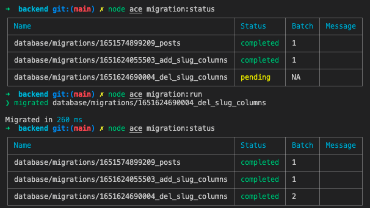

# Backend

## Build Setup

Install [Docker Compose](https://docs.docker.com/compose/install/).

```bash
# Create container with MySQL
docker-compose up -d

# Create database structure
node ace migration:run

# install dependencies
npm install

# server with changes watcher
npm run dev

# build for production and launch server
npm run build
npm run start
```
---
## Comandos Úteis

```bash
# Create migrations and prepare for creating tables
node ace make:migration posts

# Create tables: executa o comando UP das migrations não executadas
node ace migration:run

# Drop tables: executa o comando DOWN da última migration executada
node ace migration:rollback

# Cria um novo Model: cria uma nova classe Model
node ace make:model Post

# Cria um novo Controller: cria uma nova classe Controller
node ace make:controller Posts -r

# Exibe o status das migrations
node ace migration:status
```

```bash
# Exibe a lista de rotas
node ace list:routes

# Cria um novo Controller de autenticação
node ace make:controller Auth -r
```


